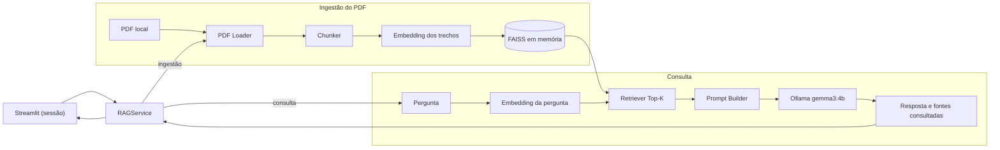

# Lab03 — chatbot RAG sobre um manual PDF

Este projeto desenvolve um MVP educacional para consultar um único manual PDF em linguagem natural e receber respostas fundamentadas com indicação de fonte e página.

## Estado atual

O backend RAG e a interface Streamlit estão integrados com o PDF do MVP. O CAP05 adicionou a suíte pytest e uma avaliação manual reproduzível do RAG; três das cinco perguntas cobertas tiveram resposta incompleta no baseline. Consulte a [avaliação de qualidade](docs/avaliacao-rag.md) para as evidências e limitações.

O documento escolhido para o MVP é [`data/guia-pratico-engenharia-software-com-ia-generativa.pdf`](data/guia-pratico-engenharia-software-com-ia-generativa.pdf).

## Roadmap

| Capítulo | Entrega | Estado |
| --- | --- | --- |
| CAP01 — Fundamentos e ambiente | Preparar Python, Git, estrutura e PDF local. | Concluído |
| CAP02 — Escopo e arquitetura | Definir requisitos, componentes, decisões técnicas e backlog. | Concluído |
| CAP03 — Backend | Implementar ingestão, embeddings, FAISS, recuperação, Ollama e smoke test. | Concluído |
| CAP04 — Frontend | Criar interface Streamlit, integrá-la ao serviço RAG e cuidar da inicialização. | Concluído |
| CAP05 — Testes e qualidade | Criar testes pytest e avaliar recuperação, fundamentação, fontes e recusa. | Concluído |
| CAP06 — Entrega final | Consolidar README, demonstração, checklist e validação final. | Próximo |

Os critérios e dependências de cada tarefa estão no [backlog](docs/backlog.md). Consulte também o [plano de implementação](plano-implementacao-lab03-atualizado.md) e o [roteiro de prompts](prompts-lab03-atualizado.md). Cada capítulo termina com revisão, verificações, conventional commit e push antes de iniciar o seguinte.

## Stack

| Componente | Tecnologia | Papel no MVP |
| --- | --- | --- |
| Linguagem e ambiente | Python 3.11 em `.venv` | Execução local do backend. |
| Leitura do PDF | PyMuPDF | Extração de texto por página. |
| Embeddings | Sentence Transformers, modelo `paraphrase-multilingual-MiniLM-L12-v2` | Vetores dos trechos e das perguntas. |
| Busca vetorial | FAISS CPU (`IndexFlatIP`) | Índice em memória e recuperação Top-K por similaridade de cosseno. |
| Geração | Ollama com `gemma3:4b` | Resposta local a partir do contexto recuperado. |
| Configuração | `python-dotenv` e `.env` opcional | Parâmetros do PDF, modelos, chunking e consulta. |
| Interface | Streamlit | Formulário de pergunta, resposta, fontes consultadas e erros. |
| Testes automatizados | pytest | Suíte local para ingestão, recuperação, serviço, cliente Ollama, configuração e interface. |

As versões das dependências diretas estão em [requirements.txt](requirements.txt), e as justificativas das escolhas em [decisões técnicas](docs/decisoes-tecnicas.md). O cliente HTTP do Ollama usa a biblioteca padrão do Python; o projeto não usa LangChain nem LlamaIndex.

## Arquitetura

O `RAGService` coordena dois fluxos. O Streamlit envia perguntas ao serviço e apresenta a resposta, sem implementar recuperação ou geração:



Os dois fluxos de embeddings usam o mesmo modelo. `ingest()` constrói o índice antes das perguntas; `ask()` o reutiliza. Cada trecho preserva arquivo e página. O prompt pede ao modelo que use somente o contexto recuperado e declare insuficiência quando ele não sustenta uma resposta. Veja os [contratos dos componentes](docs/arquitetura.md) para mais detalhes.

## Pré-requisitos e ambiente

- Python 3.11 e `pip`.
- Git.
- Ollama e o modelo `gemma3:4b` para a geração local.

No PowerShell, crie e ative o ambiente virtual caso ainda não exista:

```powershell
py -3.11 -m venv .venv
.\.venv\Scripts\Activate.ps1
python --version
python -m pip --version
```

Se a política do PowerShell impedir a ativação, execute diretamente `.\.venv\Scripts\python.exe`. Neste computador, a `.venv` foi verificada com Python 3.11.6; o `python` global aponta para Python 3.14.

Ollama 0.34.3 e `gemma3:4b` estão instalados. O plano registra uma validação prévia de geração em português e execução local em GPU. Esses dados são uma referência do notebook usado neste laboratório, não requisitos rígidos para outras máquinas.

Instale as dependências do backend, verifique o modelo Ollama e copie a configuração se quiser alterar os padrões:

```powershell
.\.venv\Scripts\python.exe -m pip install -r requirements.txt
ollama list
Copy-Item .env.example .env
```

O primeiro carregamento do modelo de embeddings baixa arquivos do Hugging Face; as execuções seguintes usam o cache local. `OLLAMA_MODEL` e `EMBEDDING_MODEL` são configurações distintas. O arquivo `.env` é opcional e ignorado pelo Git; veja [.env.example](.env.example) para os parâmetros disponíveis.

## Executar a interface

Com o serviço Ollama ativo, inicie o Streamlit na raiz do projeto:

```powershell
.\.venv\Scripts\python.exe -m streamlit run streamlit_app.py
```

Abra o endereço local exibido no terminal, digite uma pergunta e clique em **Perguntar**. A primeira abertura indexa o PDF; perguntas seguintes reutilizam o serviço na mesma sessão. Se o PDF ou a configuração efetiva mudar, a interface reconstrói o índice. A lista de fontes mostra páginas consultadas, inclusive quando o modelo declara que não encontrou a resposta.

## Executar o backend

Com o serviço Ollama ativo, execute o smoke test reproduzível:

```powershell
.\.venv\Scripts\python.exe -m app.smoke_backend
```

Ele indexa o PDF, consulta uma pergunta coberta e outra fora do manual, e mostra trechos recuperados, scores, páginas, resposta e fontes consultadas. A API Python para outras perguntas é:

```python
from app.rag_service import create_service

service = create_service()
report = service.ingest()
result = service.ask("Como diagnosticar uma resposta incorreta em RAG?")
print(result.answer)
for source in result.sources:
    print(source.chunk.source, source.chunk.page, source.score)
```

`ingest()` deve ser chamado uma vez antes de `ask()`; o índice FAISS fica em memória e é reconstruído ao reiniciar. As fontes listam os trechos enviados ao LLM, não certificam por si só que cada trecho sustenta cada frase. O prompt pede recusa quando o contexto não contém a resposta; os resultados medidos estão na [avaliação RAG](docs/avaliacao-rag.md).

## Testes e avaliação

Execute a suíte determinística sem Ollama:

```powershell
.\.venv\Scripts\python.exe -m pytest -q
```

Para repetir os oito casos de qualidade com o PDF real e `gemma3:4b`, mantenha o Ollama ativo e execute:

```powershell
.\.venv\Scripts\python.exe -m tests.evaluate_rag
```

O comando grava as observações em `docs/avaliacao-rag-observacoes.jsonl`. A [estratégia de testes](docs/testes.md) relaciona requisitos, testes e prioridades. O [relatório RAG](docs/avaliacao-rag.md) separa recuperação, contexto, resposta e abstenção; ele registra respostas incompletas no baseline que a suíte de software não detecta.

## Estrutura do projeto

| Caminho | Finalidade |
| --- | --- |
| `app/` | Componentes e serviço do backend RAG; `smoke_backend.py` verifica o fluxo real. |
| `streamlit_app.py` | Interface web fina sobre o `RAGService`. |
| `data/` | PDF do MVP e dados locais. |
| `tests/` | Testes pytest, conjunto manual de perguntas e coletor da avaliação RAG. |
| `docs/` | Escopo, requisitos, arquitetura, decisões, backlog e registros de implementação e qualidade. |
| `prompts/` | Template versionado da resposta RAG. |
| `.env.example` | Configuração opcional e valores padrão do backend. |
| `requirements.txt` | Dependências diretas da aplicação e dos testes com Python 3.11. |

As decisões do CAP02 estão em [escopo](docs/escopo.md), [requisitos](docs/requisitos.md), [arquitetura](docs/arquitetura.md), [decisões técnicas](docs/decisoes-tecnicas.md) e [backlog](docs/backlog.md). As verificações dos capítulos seguintes estão em [backend](docs/backend.md) e [frontend](docs/frontend.md).
