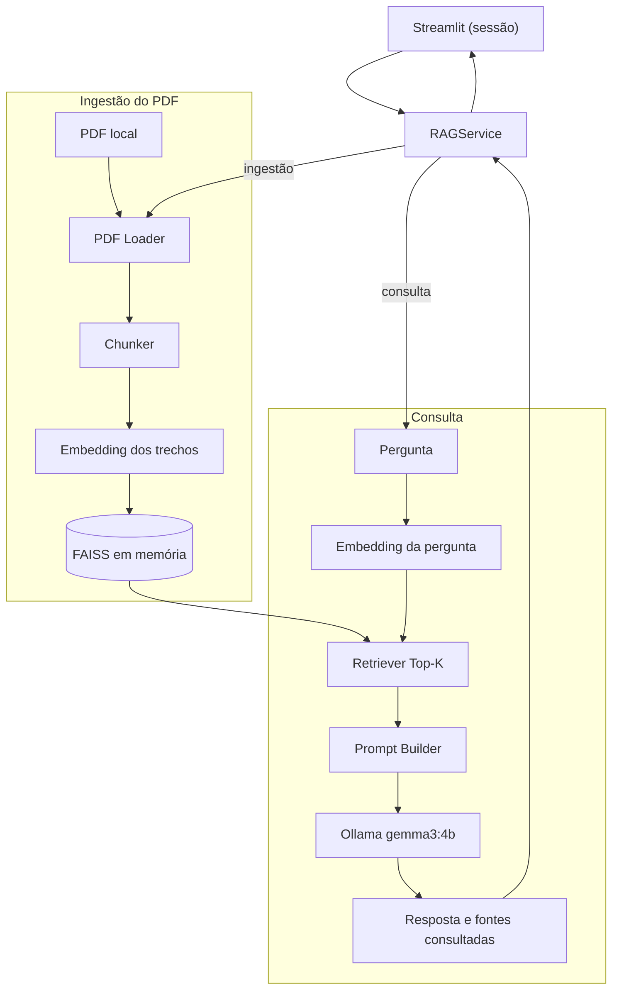
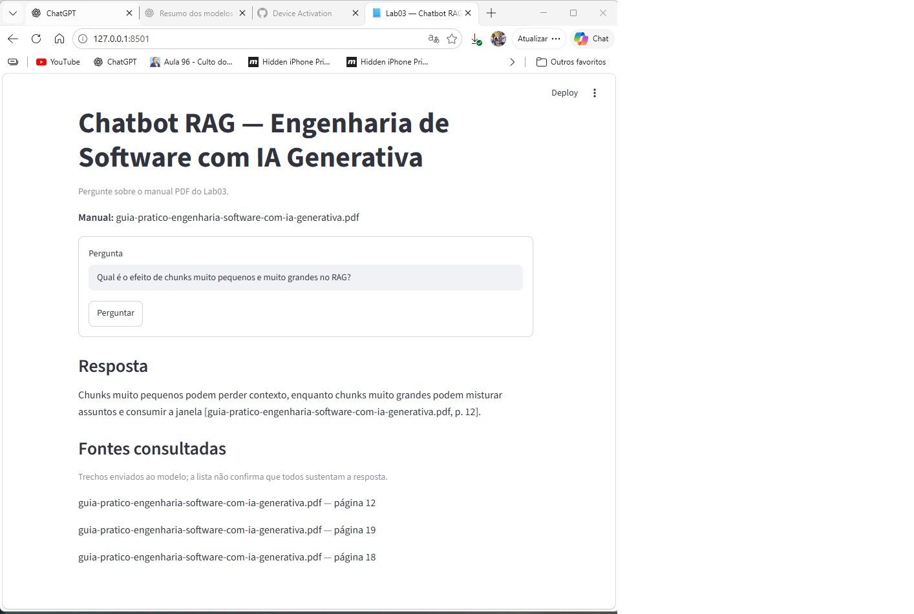

# Lab03 — chatbot RAG sobre um manual PDF

Este projeto desenvolve um MVP educacional para consultar um único manual PDF em linguagem natural e receber respostas fundamentadas com indicação de fonte e página.

## Estado atual

MVP educacional local com backend RAG, interface Streamlit, testes e documentação de entrega. Na avaliação do CAP05, três das cinco perguntas cobertas tiveram resposta incompleta no baseline. O responsável pelo projeto decidiu tratar esses casos após a entrega do MVP; as evidências permanecem na [avaliação de qualidade](docs/avaliacao-rag.md) e as ações estão em [Próximos passos](#próximos-passos).

O documento escolhido para o MVP é [`data/guia-pratico-engenharia-software-com-ia-generativa.pdf`](data/guia-pratico-engenharia-software-com-ia-generativa.pdf).

## Roadmap

| Capítulo | Entrega | Estado |
| --- | --- | --- |
| CAP01 — Fundamentos e ambiente | Preparar Python, Git, estrutura e PDF local. | Concluído |
| CAP02 — Escopo e arquitetura | Definir requisitos, componentes, decisões técnicas e backlog. | Concluído |
| CAP03 — Backend | Implementar ingestão, embeddings, FAISS, recuperação, Ollama e smoke test. | Concluído |
| CAP04 — Frontend | Criar interface Streamlit, integrá-la ao serviço RAG e cuidar da inicialização. | Concluído |
| CAP05 — Testes e qualidade | Criar testes pytest e avaliar recuperação, fundamentação, fontes e recusa. | Concluído |
| CAP06 — Entrega final | Consolidar README, demonstração, checklist e validação final. | Concluído |

Os critérios e dependências de cada tarefa estão no [backlog](docs/backlog.md). Consulte também o [plano de implementação](plano-implementacao-lab03-atualizado.md) e o [roteiro de prompts](prompts-lab03-atualizado.md). Cada capítulo termina com revisão, verificações, conventional commit e push antes de iniciar o seguinte.

## Stack

| Componente | Tecnologia | Papel no MVP |
| --- | --- | --- |
| Linguagem e ambiente | Python 3.11 em `.venv` | Execução local do backend. |
| Leitura do PDF | PyMuPDF | Extração de texto por página. |
| Embeddings | Sentence Transformers, modelo `paraphrase-multilingual-MiniLM-L12-v2` | Vetores dos trechos e das perguntas. |
| Busca vetorial | FAISS CPU (`IndexFlatIP`) | Índice em memória e recuperação Top-K por similaridade de cosseno. |
| Geração | Ollama com `gemma3:4b` | Resposta local a partir do contexto recuperado. |
| Configuração | `python-dotenv` e `.env` opcional | Parâmetros do PDF, modelos, chunking e consulta. |
| Interface | Streamlit | Formulário de pergunta, resposta, fontes consultadas e erros. |
| Testes automatizados | pytest | Suíte local para ingestão, recuperação, serviço, cliente Ollama, configuração e interface. |

As versões das dependências diretas estão em [requirements.txt](requirements.txt), e as justificativas das escolhas em [decisões técnicas](docs/decisoes-tecnicas.md). O cliente HTTP do Ollama usa a biblioteca padrão do Python; o projeto não usa LangChain nem LlamaIndex.

## Arquitetura

O `RAGService` coordena dois fluxos. O Streamlit envia perguntas ao serviço e apresenta a resposta, sem implementar recuperação ou geração:



Os dois fluxos de embeddings usam o mesmo modelo. `ingest()` constrói o índice antes das perguntas; `ask()` o reutiliza. Cada trecho preserva arquivo e página. O prompt pede ao modelo que use somente o contexto recuperado e declare insuficiência quando ele não sustenta uma resposta. Veja os [contratos dos componentes](docs/arquitetura.md) para mais detalhes.

## Pré-requisitos e ambiente

- Python 3.11 e `pip`.
- Git.
- Ollama e o modelo `gemma3:4b` para a geração local.

Obtenha o [repositório do laboratório](https://github.com/Hayltons/UFG_Curso4_Lab03_RAG) e entre na sua raiz. Se ainda não tiver uma cópia local:

```powershell
git clone https://github.com/Hayltons/UFG_Curso4_Lab03_RAG.git
cd UFG_Curso4_Lab03_RAG
```

No PowerShell, crie e ative o ambiente virtual caso ainda não exista:

```powershell
py -3.11 -m venv .venv
.\.venv\Scripts\Activate.ps1
python --version
python -m pip --version
```

Se a política do PowerShell impedir a ativação, execute diretamente `.\.venv\Scripts\python.exe`. Neste computador, a `.venv` foi verificada com Python 3.11.6; o `python` global aponta para Python 3.14.

Ollama 0.34.3 e `gemma3:4b` estão instalados. O plano registra uma validação prévia de geração em português e execução local em GPU. Esses dados são uma referência do notebook usado neste laboratório, não requisitos rígidos para outras máquinas.

Instale as dependências da aplicação e dos testes e confira os modelos disponíveis:

```powershell
.\.venv\Scripts\python.exe -m pip install -r requirements.txt
ollama list
```

Se `gemma3:4b` não aparecer, baixe-o com `ollama pull gemma3:4b`. Mantenha o aplicativo Ollama aberto; caso não haja serviço ativo, execute `ollama serve` em outro terminal. Não inicie uma segunda instância se a porta já estiver em uso. Após uma consulta, `ollama ps` permite conferir o modelo carregado e o uso de CPU/GPU.

O primeiro carregamento do modelo de embeddings baixa arquivos do Hugging Face; as execuções seguintes usam o cache local. A instalação inicial exige internet e espaço para dependências/modelos. O ambiente de referência tem i9-13900HX, 31,7 GB de RAM e RTX 4070 Laptop com 8 GB de VRAM; não foi determinado um requisito mínimo de hardware, e o desempenho em outras máquinas pode variar.

## Configuração

Os padrões funcionam sem `.env`. Para personalizar, copie o exemplo somente se ainda não existir uma configuração local:

```powershell
if (!(Test-Path .env)) { Copy-Item .env.example .env }
```

| Variável | Padrão | Finalidade |
| --- | --- | --- |
| `PDF_PATH` | `data/guia-pratico-engenharia-software-com-ia-generativa.pdf` | PDF único; caminhos relativos partem da raiz do projeto. |
| `EMBEDDING_MODEL` | `sentence-transformers/paraphrase-multilingual-MiniLM-L12-v2` | Modelo dos vetores de documentos e perguntas. |
| `OLLAMA_MODEL` | `gemma3:4b` | Modelo generativo instalado no Ollama. |
| `OLLAMA_URL` | `http://127.0.0.1:11434` | Endereço do serviço Ollama. |
| `OLLAMA_TIMEOUT` | `120` | Tempo máximo de espera, em segundos. |
| `TOP_K` | `4` | Quantidade máxima de chunks recuperados. |
| `CHUNK_SIZE` / `CHUNK_OVERLAP` | `350` / `50` | Janela e sobreposição em caracteres. |
| `MAX_CONTEXT_CHARS` | `2500` | Limite do contexto com referências, em caracteres. |

Variáveis do processo têm precedência sobre `.env`, que tem precedência sobre os padrões. O `.env` é opcional e ignorado pelo Git. `OLLAMA_MODEL` e `EMBEDDING_MODEL` têm funções distintas; mudar o LLM não altera os embeddings. A avaliação do CAP05 exige o PDF e os parâmetros baseline indicados acima.

## Executar a interface

Com o serviço Ollama ativo, inicie o Streamlit na raiz do projeto:

```powershell
.\.venv\Scripts\python.exe -m streamlit run streamlit_app.py --server.address 127.0.0.1
```

Abra o endereço local exibido no terminal, digite uma pergunta e clique em **Perguntar**. A primeira abertura indexa o PDF; perguntas seguintes reutilizam o serviço na mesma sessão. Se o PDF ou a configuração efetiva mudar, a interface reconstrói o índice. A lista de fontes mostra páginas consultadas, inclusive quando o modelo declara que não encontrou a resposta. Encerre com `Ctrl+C` no terminal. O [roteiro de demonstração](docs/demo.md) contém oito perguntas e orienta a conferência das páginas.

## Interface em funcionamento

A captura mostra uma pergunta sobre o tamanho dos chunks, a resposta com citação da página 12 e as páginas consultadas pelo modelo. As demais páginas da lista são trechos enviados como contexto; elas não precisam sustentar essa resposta específica.



## Executar o backend

Com o serviço Ollama ativo, execute o smoke test reproduzível:

```powershell
.\.venv\Scripts\python.exe -m app.smoke_backend
```

Ele indexa o PDF, consulta uma pergunta coberta e outra fora do manual, e mostra trechos recuperados, scores, páginas, resposta e fontes consultadas. A API Python para outras perguntas é:

```python
from app.rag_service import create_service

service = create_service()
report = service.ingest()
result = service.ask("Como diagnosticar uma resposta incorreta em RAG?")
print(result.answer)
for source in result.sources:
    print(source.chunk.source, source.chunk.page, source.score)
```

`ingest()` deve ser chamado uma vez antes de `ask()`; o índice FAISS fica em memória e é reconstruído ao reiniciar. As fontes listam os trechos enviados ao LLM, não certificam por si só que cada trecho sustenta cada frase. O prompt pede recusa quando o contexto não contém a resposta; os resultados medidos estão na [avaliação RAG](docs/avaliacao-rag.md).

## Testes e avaliação

Execute a suíte determinística sem Ollama:

```powershell
.\.venv\Scripts\python.exe -m pytest -q
```

Para repetir os oito casos de qualidade com o PDF real e `gemma3:4b`, mantenha o Ollama ativo e execute:

```powershell
.\.venv\Scripts\python.exe -m tests.evaluate_rag
```

O comando substitui as observações em `docs/avaliacao-rag-observacoes.jsonl`; preserve a versão anterior no Git para comparar execuções. Ele coleta resultados para revisão manual, sem calcular automaticamente a qualidade das respostas. A [estratégia de testes](docs/testes.md) relaciona requisitos, testes e prioridades. O [relatório RAG](docs/avaliacao-rag.md) separa recuperação, contexto, resposta e abstenção; ele registra respostas incompletas no baseline que a suíte de software não detecta.

## Limitações do MVP

- Um PDF por vez, com texto extraível; não há upload pela interface, OCR, leitura de PDF protegido por senha ou integração de vários manuais.
- O chunker corta por caracteres e pode dividir palavras/listas. O Top-K pode recuperar trechos incompletos ou irrelevantes. Na avaliação, C01 (CO-STAR) e C05 (dimensões de avaliação) receberam contexto insuficiente; C03 (fluxo Git) ficou incompleta apesar de contexto suficiente.
- Citações e fontes consultadas ajudam a conferir a resposta, mas não certificam sua correção. A recusa funcionou nos dois casos fora do manual avaliados; não é garantida para qualquer pergunta. O limite em caracteres também não equivale a um orçamento exato de tokens do LLM.
- Índice e modelo ficam em memória por sessão. Reiniciar ou abrir outra sessão reconstrói os recursos. Não há histórico de conversa, autenticação ou preparação para uso multiusuário/produção; o comando de execução fica restrito ao computador local.
- Dependências diretas estão fixadas, mas não há lock completo das transitivas nem revisão imutável do modelo de embeddings. A validação foi feita no ambiente existente; uma instalação limpa em outra máquina não foi reproduzida nesta entrega.

## Solução de problemas

| Sintoma | Verificação e ação |
| --- | --- |
| Ativação da `.venv` bloqueada ou Python errado | Use diretamente `.\.venv\Scripts\python.exe`; confira `--version` (3.11). |
| Dependência ausente | Execute `python -m pip install -r requirements.txt` com o Python da `.venv`, depois `python -m pip check`. |
| Ollama indisponível | Verifique `ollama list`, abra o aplicativo/serviço e confira `OLLAMA_URL`; use `ollama serve` apenas se não houver serviço ativo. |
| Modelo generativo indisponível | Confira `ollama list`; se necessário, execute `ollama pull gemma3:4b` e confira `OLLAMA_MODEL`. |
| Falha ao carregar embeddings | No primeiro uso, confira internet e acesso ao Hugging Face. `HF_HUB_OFFLINE=1` só é útil se o modelo já estiver completo no cache; remova essa opção para permitir download. |
| PDF ausente, sem texto ou com senha | Confira `PDF_PATH` e use o PDF versionado em `data/`; scans exigiriam OCR, fora desta versão. |
| Trechos/pergunta excedem tokens | Use o baseline para o manual do MVP ou reduza o tamanho da pergunta. Ajustes no chunking exigem nova avaliação de qualidade. |
| Timeout de geração | Confira os recursos e `ollama ps`; o limite é `OLLAMA_TIMEOUT`. Aumentá-lo altera apenas a espera, não a qualidade da resposta. |
| Porta Streamlit ocupada | Acrescente `--server.port 8509` ao comando de execução e abra o endereço informado. |
| Resposta incompleta ou fonte pouco relevante | Compare com a página do PDF e o [relatório de avaliação](docs/avaliacao-rag.md); não interprete score como confiança factual. |

## Contribuição da IA no desenvolvimento do MVP

O desenvolvimento foi conduzido com assistência de IA no Codex, a partir do plano e dos prompts CO-STAR do laboratório. A IA auxiliou na definição dos componentes, implementação do backend e da interface, criação de testes, análise das saídas do RAG e documentação. O responsável pelo projeto definiu o escopo, o PDF, as etapas e as decisões de aceite, inclusive adiar as correções das respostas incompletas.

As verificações incluem testes determinísticos e consultas ao modelo local; os resultados estão registrados, inclusive as falhas. A IA usada para auxiliar o desenvolvimento é distinta do `gemma3:4b`, que gera as respostas do chatbot em execução. A assistência não substitui a revisão humana do código nem a conferência das respostas no manual.

## Próximos passos

1. Tratar C01, C03 e C05 após a entrega: comparar cortes em limites de frase/parágrafo, expansão de trechos vizinhos e organização do contexto. Reavaliar as mesmas perguntas e as recusas, preservando as observações baseline para medir regressões.
2. Ampliar o conjunto de avaliação, repetir consultas para medir variação e registrar metadados da geração. Reavaliar o modelo somente com evidências que distingam recuperação e geração.
3. Suportar mais de um manual e carregamento de novos PDFs, com validação dos arquivos e identificação de fontes entre documentos.
4. Permitir escolha pela interface entre modelos locais e provedores remotos, considerando capacidade da máquina, custo e privacidade. Hoje só o modelo servido pelo Ollama é configurável via ambiente; não há integração com outros provedores.
5. Melhorar a reprodução em outras máquinas com lock das dependências, revisão fixa dos modelos e instalação limpa validada; avaliar persistência do índice e compartilhamento de recursos se o uso crescer.

Essas evoluções estão fora da entrega atual. Os achados e o aceite das limitações constam da [revisão final](docs/revisao-final.md) e do [checklist de release](docs/release-checklist.md).

## Estrutura do projeto

| Caminho | Finalidade |
| --- | --- |
| `app/` | Componentes e serviço do backend RAG; `smoke_backend.py` verifica o fluxo real. |
| `streamlit_app.py` | Interface web fina sobre o `RAGService`. |
| `data/` | PDF do MVP e dados locais. |
| `tests/` | Testes pytest, conjunto manual de perguntas e coletor da avaliação RAG. |
| `docs/` | Escopo, requisitos, arquitetura, decisões, backlog e registros de implementação e qualidade. |
| `prompts/` | Template versionado da resposta RAG. |
| `.env.example` | Configuração opcional e valores padrão do backend. |
| `requirements.txt` | Dependências diretas da aplicação e dos testes com Python 3.11. |

As decisões do CAP02 estão em [escopo](docs/escopo.md), [requisitos](docs/requisitos.md), [arquitetura](docs/arquitetura.md), [decisões técnicas](docs/decisoes-tecnicas.md) e [backlog](docs/backlog.md). As verificações dos capítulos seguintes estão em [backend](docs/backend.md) e [frontend](docs/frontend.md).
