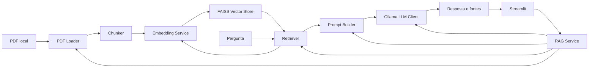

# Arquitetura proposta

O MVP mantém dois fluxos separados: a ingestão transforma o PDF em trechos indexados; a consulta reutiliza esse índice para responder perguntas. O backend expõe uma API Python simples, independente da interface.

As setas de `RAG Service` mostram orquestração, enquanto as demais mostram o fluxo de dados. Streamlit chama apenas o serviço.

## Responsabilidades e contratos conceituais

| Componente | Responsabilidade | Entrada → saída |
| --- | --- | --- |
| Configuração | Validar parâmetros e caminhos usados pelos demais componentes. | Variáveis de ambiente/valores padrão → configuração válida. |
| PDF Loader | Abrir o PDF e extrair texto por página, com erros claros. | Caminho → páginas com texto, arquivo e página começando em 1. |
| Chunker | Dividir cada página sem perder a origem. | Páginas → trechos com ID, texto, arquivo e página. |
| Embedding Service | Carregar um modelo e codificar trechos/perguntas na mesma dimensão. | Textos → vetores numéricos. |
| Vector Store | Indexar vetores normalizados e manter correspondência com os trechos. | Trechos + vetores → índice; vetor da pergunta + K → resultados com score. |
| Retriever | Coordenar embedding da pergunta e busca Top-K. | Pergunta → trechos ordenados com score e metadados. |
| Prompt Builder | Limitar e identificar o contexto; pedir resposta baseada nele ou declaração de insuficiência. | Pergunta + trechos → prompt. |
| LLM Client | Enviar prompt ao Ollama e tratar indisponibilidade/erro do modelo. | Prompt → texto gerado. |
| RAG Service | Coordenar `ingest(pdf_path)` e `ask(question)`; devolver resposta e fontes. | PDF/pergunta → índice/resposta estruturada. |
| Streamlit | Receber pergunta e apresentar resultado e erros. | Entrada do usuário ↔ RAG Service. |

Conceitualmente, um trecho contém `id`, `text`, `source` e `page`. Um resultado de recuperação acrescenta `score`; a resposta contém `answer` e `sources`. A posição retornada pelo FAISS identifica o trecho correspondente. Esses contratos orientam a implementação, sem exigir classes ou camadas extras no CAP03.

## Ingestão

1. Validar o caminho e abrir o PDF. Rejeitar documento inválido ou sem texto útil.
2. Extrair páginas em ordem e guardar arquivo e página. Não juntar páginas antes de dividir o texto.
3. Dividir o conteúdo em trechos com tamanho e sobreposição configuráveis; ignorar trechos vazios.
4. Codificar os trechos e verificar quantidade, dimensão e valores finitos dos vetores.
5. Normalizar vetores e criar um índice exato `IndexFlatIP` em memória, mantendo uma lista paralela de trechos. Falha de ingestão não deve deixar um índice parcialmente utilizável.

Para o único PDF, o índice em memória evita formato de persistência e sincronização adicionais. A ingestão ocorre uma vez na inicialização do processo; uma nova execução reconstrói o índice. O CAP04 pode usar cache de recursos do Streamlit se o recarregamento em cada interação for observado, preservando o serviço como dono da ingestão. Nesse caso, mudanças no PDF, no modelo ou nos parâmetros de divisão precisam invalidar o recurso em cache.

## Consulta

1. Validar a pergunta; não fazer busca para entrada vazia.
2. Codificar a pergunta com o mesmo modelo, normalizar o vetor e consultar até `Top-K` trechos.
3. Montar contexto com referências identificáveis e limite compatível com a janela real do Ollama. O score ajuda a inspecionar a busca, mas não comprova que o trecho responde à pergunta.
4. Se não houver trechos utilizáveis, devolver falta de informação. Caso contrário, pedir ao LLM que responda apenas com evidência presente e declare insuficiência quando necessário.
5. Devolver resposta e lista dos trechos enviados ao modelo. A interface exibe arquivo/página desses trechos como fontes consultadas.

O baseline sugerido para experimentar é `Top-K=4`, `chunk_size=350` caracteres e `chunk_overlap=50` caracteres. Esses valores ainda não foram medidos no manual. O modelo de embeddings proposto aceita sequências de até 128 tokens; caracteres não equivalem a tokens. O CAP03 deve medir truncamento e ajustar o tamanho se necessário. O CAP05 avaliará qualidade e eventual limiar de relevância antes de adotá-lo.

## Dependências e limites

- `RAG Service` depende de Loader/Chunker/Embedding/Store na ingestão e de Retriever/Prompt Builder/LLM Client na consulta. Componentes não importam Streamlit.
- O índice FAISS usa produto interno de vetores normalizados, equivalente à similaridade de cosseno. Maior score indica maior proximidade vetorial; não equivale a confiança factual.
- O prompt deve tratar o conteúdo do PDF como dado, não como instrução para o sistema. O LLM pode errar mesmo com contexto correto; o CAP05 examina isso com casos reais.
- A janela de 4096 tokens e o uso de GPU vieram da validação prévia do notebook. O cliente e o limite de contexto não devem depender da GPU nem assumir que outra máquina terá a mesma configuração.
